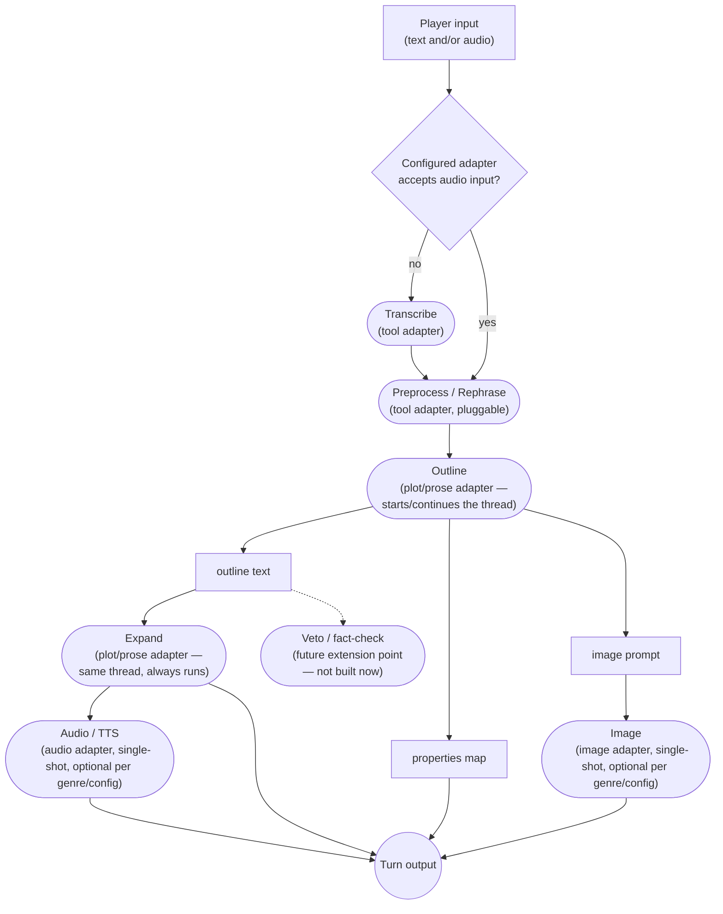
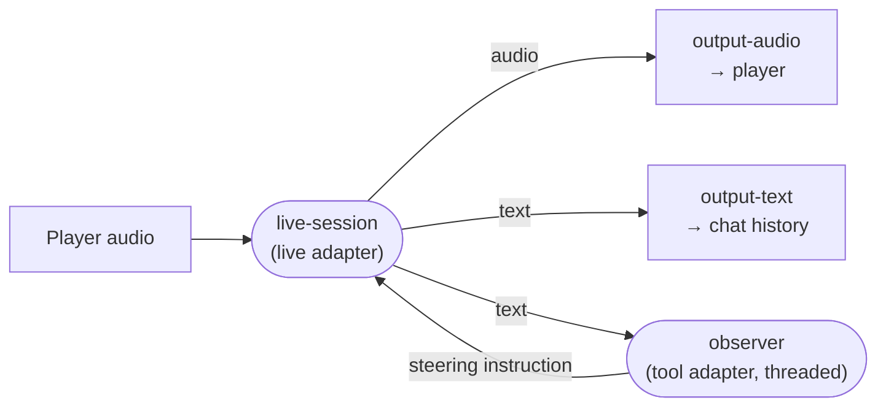

# ENGINE.md — Splitting the Game Engine from the Platform

This is an evaluation document: a technical implementation plan for extracting ChatGameLab's
game engine from the platform (accounts, organisations, workshops, sharing, game authoring) into
a standalone, reusable, embeddable capsule. It is not a pitch — there's no cost or timeline
analysis here, no deadline, and no build has started. It exists so the shape of the work is
written down before deciding whether to do it.

## Why

A second project needs a similar AI-generated interactive experience — spoken dialogues with a
single character on a single topic, no workshops, no sharing, no organisational structure.
Building that as a fork of ChatGameLab would duplicate the engine and diverge over time. Building
it by hacking a second flow into the current, deeply platform-entangled engine would make both
worse. The alternative: pull the actual game engine out into something the platform consumes the
same way any other embedder would — including, eventually, that second project, or any other site
that wants to embed a single AI-driven game with no community features attached.

A useful side effect, not the goal: the platform itself gets simpler once the engine's complexity
moves out of it.

## Scope

- Two genres: **Adventure** (today's only genre, rebuilt by wiring building blocks) and
  **NPC-Live** (the new one, the actual reason this work exists — a voice-driven conversation with
  a single character, running on a live speech-to-speech model). No others are currently planned.
- Genres are a small, fixed, hand-built set of Go wirings — not a DSL, not user-authorable, not
  declared in data. Every attempt to over-generalize this ends the same way: reinventing a
  programming language. Two genres do not justify that cost.
- This document does not cover the platform's business logic (accounts, permissions, workshops,
  sharing, jugendschutz cascade resolution) except where the engine's boundary touches it.

## Building blocks

The engine ships a library of **building blocks** — small, configurable primitives, each wrapping
one mechanism. A block is typed by what it does *mechanically*, and configured by prompt into
whatever role a genre needs it to play:

| Block | Mechanism | Roles it gets configured into |
|---|---|---|
| **Tool call** | one single-shot text-in/text-out call | third-person rephrase, condense-scenario, translate image style, any short transformation |
| **Threaded call** | a call on a continuing conversation | Outline and Expand, sharing one thread |
| **Structured extraction** | a call returning a typed properties map | status tracking, theme generation |
| **Image generation** | prompt in, image out | scene illustration |
| **Speech synthesis** | text in, audio out | narration |
| **Transcription** | audio in, text out | voice input on a turn-based genre |
| **Live session** | a long-lived, full-duplex speech-to-speech connection | NPC-Live's entire wiring |

Shaping blocks by mechanism rather than by task is what keeps the library small. "Rephrase the
player's input" and "condense a scenario for image prompts" are the same block with different
prompts, so a new short transformation costs a config entry instead of a new type.

**Output sinks are blocks too** — `output-text`, `output-audio`, `output-image`, `output-status`.
They carry no prompt and run no model call, so they're a second family under the same word. Which
means blocks do *not* share one uniform interface, and shouldn't be made to: once genres are
wiring, a shared signature buys nothing. What the library gives you is a catalogue of pluggable
things.

### Typed ports

A block exposes **named, typed ports** rather than one union-typed input and one union-typed
output. `live-session` alone needs two of each — player audio and instruction injection in, audio
and text out — which a single-slot interface can't express.

Ports are Go interfaces, one pair per data type, and wiring is a method on the graph — a method
rather than a free function because the edge has to be recorded somewhere for the validity check
below to have anything to check:

```go
func (g *Graph) ConnectAudioOut(src AudioOut, dst AudioIn)
func (g *Graph) ConnectTextOut(src TextOut, dst TextIn)
```

```go
g := ports.NewGraph("npc-live")
g.ConnectAudioOut(player, live)
g.ConnectAudioOut(live, outAudio)   // speech to the player
g.ConnectTextOut(live, outText)     // transcript as chat history
g.ConnectTextOut(live, observer)    // same source, second consumer
g.ConnectTextOut(observer, live)    // the back edge: steering instruction
```

**Inputs and output sinks are nodes.** `PlayerInputText`, `PlayerInputAudio` and their dummy
counterparts are sources; `PlayerOutputText`, `PlayerOutputAudio`, `PlayerOutputImage` and
`PlayerOutputProps` are sinks. One node per stream rather than one node with four ports, which is
what makes a genre's event schema readable straight off its graph.

**A source port hands out a fresh stream per call.** This is a hard rule on every block, not an
implementation detail: `TextOutPort()` subscribes, it doesn't return a shared channel. Two
consumers of one shared channel would *steal* from each other — the observer eating half the
player's transcript — and nothing about the types would catch it. Subscription also happens when
the edge is connected rather than when the graph starts, so a source that emits immediately cannot
outrun its consumers.

Where a block genuinely carries two outputs of one type — Outline emits a plot outline and an image
prompt, both text — the second is exposed through a `SecondaryTextOut` interface, since a struct
satisfies any given interface only once. No block is expected to need a third. If one ever does,
that's the signal it's doing too much and should be split, rather than the start of an ordinal
ladder.

Four properties follow, and they're the reason ports are interfaces rather than a
`RegisterPipe(TypeAudioOut, from, to)` call carrying a runtime type tag:

- **The graph is compile-checked.** A block that doesn't implement `AudioOut` can't be passed where
  one is wanted. A runtime tag defers that to session start — which in practice means a workshop.
- **Fan-out is just calling `Connect` twice** on the same source. Each consumer gets its own
  stream, so the latency-critical frontend edge never waits on the slow observer edge. No splitter
  block is needed; one would only be worth adding to give a fork its own name in the graph.
- **Cycles cost nothing.** Blocks exist before any edge is drawn, so a back edge is the same call
  as a forward one. A builder requiring upstream-before-downstream would choke on exactly the loop
  NPC-Live needs.
- **Shared plumbing stays small**, because the interfaces are keyed to data type rather than to
  port role. Buffering, fan-out and any later tracing tap are written once per type — audio, text,
  image, properties — instead of once per port.

A genre's wiring is therefore a directed graph over nodes of three kinds — inputs, AI blocks and
output sinks — and it is **not required to be acyclic**: the observer feedback edge is a cycle on
purpose.

**Validity is split between the compiler and a unit test.** Types settle whether an edge is legal;
they say nothing about whether the graph is complete. Because every pipeline is hardcoded and there
are two of them, a per-genre test can check the rest exhaustively: every required input port has a
source, every block is reachable from an input, and every output block the genre's event schema
advertises is actually wired. A cheap test that only stays cheap because pipelines are never
user-authored.

The one check neither catches is **termination of a cycle**. The observer watches NPC output and
injects steering, which produces more NPC output for it to watch — self-sustaining by design, and
capable of running away if a correction itself trips the classifier. A bound on consecutive
interventions belongs in the observer block rather than in the graph.

Ports stay **narrowly typed to exactly what a block needs**. No port ever carries "the whole turn
so far" — that makes a block's true dependencies invisible and every test require faking an entire
turn's worth of state.

There is also **no generic block-execution engine** — no scheduler walking a declarative graph and
running whatever happens to be ready. The graph in a genre's wiring is Go, and that distinction is
load-bearing rather than aesthetic: expressed in Go, the compiler checks it; expressed in data, it
needs a runtime validator and the type safety above evaporates. Two genres do not justify paying
that.

## Genres are wiring

A genre is **Go code that wires blocks together**. Genres are a small, fixed, hand-built set,
written by hand and compiled in — a genre is code, not data, and never user-authorable.

An earlier draft of this document specified the opposite: one generic hardcoded pipeline that every
genre ran through, realized by toggling optional stages on and off. That is abandoned. NPC-Live
broke it immediately, because a live speech-to-speech session decomposes into no stages at all —
it is one connection, held open. A spine that only one of two genres can sit on is not a spine.

What the engine provides is the block library, the `SessionSpec`, the persistence interface and the
protocol. What a genre provides is orchestration — hardcoded Go, including its own parallel fan-out
(goroutines/`errgroup`).

### Adventure

Adventure's wiring is the pipeline the current engine already runs, rebuilt from blocks. Its shape
was arrived at empirically, not by generalizing on principle: an earlier, single-shot version of
the "generate what happens next" step showed real problems — it was too sycophantic, too willing to
just do what the player asked. Splitting it into rephrase → outline → expand fixed that:

- **Rephrase** turns the player's raw input into third person with an uncertain outcome, which
  distances the AI from the player's literal will and keeps it in control of the fiction rather
  than the player dictating outcomes.
- **Outline** is told to model a plausible world reacting to what the (rephrased) player
  character does — "you're writing a book, this is what the protagonist does" — which produces a
  more grounded, less compliant plot than asking for the final prose directly.
- **Expand** then enriches that plausible-but-terse outline into full narrative prose.



Notes on this diagram:

- **The Transcribe branch is capability-driven.** Whether Transcribe runs at all depends on whether
  the *adapter currently plugged into the Preprocess slot* accepts audio input directly — a
  property of whichever model got resolved into that role, checked once by the wiring itself. If a
  future tool-tier model takes audio directly, the separate Transcribe call stops happening with no
  genre code changing.
- **Image and Audio are optional**, toggled in Adventure's own configuration.
- **Veto/fact-check is explicitly not being built now.** It's noted so the shape doesn't
  accidentally preclude it later: a block whose output is pass/fail rather than content, hanging
  off the same outline Expand and Image consume, with the authority to reject a turn and force
  regeneration. Worth designing *for*, not designing *now*.

### NPC-Live

NPC-Live's wiring puts **nothing in the conversation's path**: one live speech-to-speech session,
opened at launch and held open for the conversation's lifetime. No rephrase, no outline, no expand
— the entire value of a live model is that nothing sits between the player's voice and the reply,
and three sequential calls per turn would destroy exactly that.

Control comes from the side instead, as an **observer loop**:



The live block's text output goes two places at once. One edge is the player's chat history; the
other feeds an observer that classifies what the NPC just said — is it inside the youth-protection
guardrail, is it turning sycophantic, is it still in character — and injects a correcting
instruction back into the live session when it isn't.

**The player's own speech is not transcribed for display or for the record.** Nobody re-reads what
they just said aloud, and an ASR transcript that diverges from what the conversation model acted on
is a poor record to keep. Whether it's still worth transcribing *purely as observer input* is open
(see below).

Two notes on the observer:

- **Sycophancy is a trajectory property.** A single NPC line almost never reads as capitulation; a
  character softening shows across several exchanges. So the observer keeps its own thread over
  recent NPC output rather than scoring each chunk cold. Guardrail violations, by contrast, are
  usually visible in one utterance.
- **Two prompt slots, two provenances.** The youth-protection guardrail arrives in the
  `SessionSpec` from the platform's cascade and is not editable by a game designer — collapsing it
  into the designer's own text would hand a game author a lever on youth protection that
  JUGENDSCHUTZ.md deliberately denies them. The designer authors the second slot, the **scenario**:
  the setting and rules for Adventure, and for NPC-Live who the character is and what they must not
  concede. One field, both genres.

Verified against OpenAI's Realtime API in September 2026, because these properties decide what the
protocol and the persistence layer have to carry:

- **The model's own speech arrives with its text**, streamed alongside the audio
  (`response.output_audio.delta` and `response.output_audio_transcript.delta`). This side of the
  conversation is verbatim.
- **The player's speech is transcribed by a separate ASR model** — opt-in via
  `input_audio_transcription`, with `gpt-live-transcribe` streaming deltas as speech arrives. It
  runs asynchronously from the response, so its events may arrive before or after the reply they
  belong to, and OpenAI documents the output as a rough guide that may diverge from what the
  conversation model actually acted on.
- **Instructions can be changed mid-session** via `session.update`, so the jugendschutz constraint
  can be re-injected during a conversation rather than fixed at launch. The voice is the exception:
  settled once the model has produced audio once.
- Current speech-to-speech model: `gpt-realtime-2.1`.

Two consequences the engine has to design around. **The persisted record is asymmetric** — the
NPC's half is exactly what it said, the player's half is one model's approximation of what a
different model heard. Anything presenting a transcript as an audit trail, including the
AI-insights view and any youth-protection review, has to be honest about which half is which. And
**event order is not guaranteed**, so reconstructing a conversation means sorting events rather
than trusting arrival order.

**Sycophancy is the open question.** Rephrase → outline → expand exists precisely because a
single-shot call was too willing to do what the player asked, and NPC-Live is a single-shot call by
construction. Whether a live model holds a character who must refuse — a gatekeeper who won't let
you past, a witness who won't name the culprit — against a player actively trying to talk it out of
that role is unknown. It is the first thing the spike has to answer.

## AI adapters

Building blocks don't share one AI adapter — they use a **set of five adapter roles**, each
resolving to its own model/tier under the session's one platform and API key:

Roles are named by mechanism, like the blocks that use them. What a genre calls a role —
Adventure's "plot", say — is a use case and stays in the genre:

| Role | Used by | Continuity |
|---|---|---|
| **Tool** | Preprocess/Rephrase, Transcribe, Translate, condense-scenario | Single-shot |
| **Threaded** | Outline and Expand, which Adventure calls its plot/prose stage | **Threaded** — one continuing conversation |
| **Image** | Image generation | Single-shot |
| **Audio** | TTS, transcription | Single-shot |
| **Live** | NPC-Live's live-session block | **Duplex** — one long-lived bidirectional session |

**Tiers pick the model for each role.** A session names one `ModelTier` — economy, balanced,
premium or max — and the platform's own preset table turns it into a model per role, so the engine
holds no model names of its own. Two escape hatches, both explicit:

- `ModelLive: "gpt-realtime-2.1"` pins one role to a named model.
- `ModelThreaded: "$max"` lifts one role to another tier, which is how a cheap session keeps one
  expensive stage.

The `$` sigil is what keeps those unambiguous: no model name starts with it, so a field never has
to be guessed at. A tier may leave a role empty, which means the role is unavailable there —
economy generates no images, and speech output is a top-tier feature.

The first four were verified against the current implementation, not assumed. The Live role is new
and has no v1 counterpart to check against:

- `ToolQuery(ctx, apiKey, prompt)` takes no session at all — nothing to thread, confirming it's
  single-shot by construction.
- `ExecuteAction` (Outline) and `ExpandStory` (Expand) both read a `ResponseID` out of
  `session.AiSession`, pass it as `PreviousResponseID`, and write the new response ID back after
  the call. `ExpandStory` picks up the exact ID `ExecuteAction` just wrote — this is **one shared
  thread across both calls**, not two independent ones. Matches the documented "alternating
  phases" behaviour (a JSON phase, then a NARRATE phase, same conversation).
- `GenerateImage` never touches `AiSession` in either provider implementation; Mistral's own
  implementation says so explicitly in its doc comment — "a separate one-shot conversation, not
  the game conversation."
- Neither `GenerateAudio` (TTS) nor `TranscribeAudio` touch `AiSession` either.

**Consequence for persistence:** because the Threaded role is a real conversation, its
continuation token (response/conversation ID) is state that must survive between calls and across
turns — the same category of thing as a generated image, not a special case. A live session's
conversation id is the same kind of thing.

It is stored **per block, keyed by the block's name in the wiring**, rather than as one field on
the session. A genre may wire two independent threads, and a single field could not hold both.
Resuming rebuilds the graph and hands each block back what it exported; a stored name the wiring no
longer has is an error rather than something to limp past, because it means the wiring changed
under a stored session — exactly the case that should invalidate it.

## The SessionSpec

A session is launched from one self-contained `SessionSpec`. The engine never calls back into
platform data to resolve anything — everything it needs arrives already resolved:

- **Prompts** — per building block, admin-tunable config, not hardcoded strings. This includes
  the jugendschutz constraint text, which is not a distinct field or a special type — it's simply
  one of the prompts, re-injected every turn so the model doesn't drift away from it. Which
  cascade level (workshop / organisation / site-by-age) produced that value is entirely the
  platform's concern, resolved before the spec is assembled; the engine can't tell a
  cascade-resolved prompt from a hand-authored one, and doesn't need to.
- **Genre** — which wiring runs. Fixed for the session's lifetime.
- **AI configuration** — platform and tier resolution for each of the five adapter roles.
- **A key provider, not a key** — who pays, supplied as an injected function rather than a field.
  Two reasons. The spec is persisted as a blob, so a key field would write the secret into the
  database once per session, and into anything that logs a spec. And resolving at the point of use
  means a rotated or revoked key takes effect without relaunching, which is what v1 already gets by
  re-resolving every turn.

  The platform injects a function closing over its existing resolver; a standalone launcher injects
  one reading a flag or `~/.chatgamelab/config.yaml`. The engine never learns where a key lives,
  and never holds one longer than a request.

A `SessionSpec` can be assembled two ways, and the engine can't distinguish which:

1. **Platform-resolved** — the portal's normal session-creation flow runs the full jugendschutz
   cascade and API-key resolution, and drops the results into spec fields.
2. **Hand-assembled** — a dev launcher, or a third party embedding the engine directly, supplies a
   raw key and directly-specified prompt/constraint values with no ChatGameLab account involved at
   all. Same spec shape, assembled by hand instead of by a cascade.

## The graph is P-shaped: init, then loop

A genre's wiring has a **stem and a bowl**. The stem runs once — v1 does this already, fusing its
system message, translating the image style and generating the theme before the first turn — and
the bowl is the turn loop, which cycles.

They join at a **gate**. Every block whose result the first turn depends on reports *done* to it,
and play begins when the last one has.

The init stem is a pipeline, not a set of independent tasks, which is why it is expressed as graph
rather than as a lifecycle hook. v1's preparation already has chains: condense the scenario, then
translate it, then fuse it into the system message. Edges express that; parallel callbacks cannot.
It also means init products reach play blocks through ordinary edges — the fused system message is
an input to the outline block, not something handed over out of band — so there is no second
mechanism for moving values around.

**Blocks report their own state** on a port of its own — `ready` or `working`, carrying the name of
the block reporting. Two values are enough: "not working" needs no distinction between
never-started and finished, and a block in the turn loop is never finished anyway. A block reports
its initial phase at startup and then only changes, so a reader sees one `working` and one `ready`
per piece of work.

**The gate waits for working-then-ready**, not for an announcement of completion. That cannot be
satisfied by a block which never started, and it does not rely on a block's data output, where the
first value says it has *started* producing — which for anything streaming is not the same as
having finished. Reporting separately from data also lets a block tell the gate it is finished
while its output goes somewhere else entirely.

The contract that follows: a gating block owes the gate a working-then-ready cycle **even when it
finds it has nothing to do**. A resumed session skipping its image generation still reports one, or
the game never starts. A block whose work fails reports one too, or a single broken optional step
holds the gate shut forever.

**Every report reaches the client**, not only the ones wired to a gate. The engine subscribes to
every block's state port by introspection and puts the changes on the session stream, so a client
fetches the wiring once from `/topology` and then only tracks phases. Gating stays a wiring
decision made with edges; observing the whole graph is not, and should not need ten edges drawn
into a collector node to work.

Volume is not a concern, because blocks report *changes* rather than activity: two events per piece
of work, against thousands of audio chunks.

The report names its block for two reasons. A gate has to tell one reporter from another — a block
in the loop works repeatedly, and a busy one must not stand in for a silent one — and a view
drawing the graph has to know which node lit up. That second reason is the substance of the
deferred graph view: the phases describe the loop as well as the stem, and how a block oscillates
is characteristic. A live session stays `working` for a whole conversation; an observer flicks
through it once per line it judges.

**What gates is a wiring decision, not a policy.** NPC-Live's portrait is init work whose signal is
deliberately *not* wired to the gate: a conversation can start before the picture exists, and
holding a player in silence while an image renders is the wrong trade. A failing block still
reports done, because one broken optional step must not hold the gate shut forever.

A genre with nothing to prepare has a gate with no inputs, which opens immediately — so a caller
never has to ask which kind of genre it got.

Making "before play" a real point in time also removes a class of ordering bug: a block acting on a
player's input before the values it needs have arrived, which otherwise resolves correctly most of
the time and not always.

## Session & persistence model

**Auth authorizes launching a session, not playing one.** Once launched, the session id is a
self-sufficient bearer handle — whoever holds it can continue the session. This is what makes
iframe embedding safe: the spendable API key never reaches client-side code, only a scoped session
id does, and that id can't be used to launch anything new. Attaching a session to a user is
optional platform-side bookkeeping (a mapping table the platform keeps outside the engine), not a
structural requirement of a session.

**Two tables, and as few columns as will do the job.** Whatever the engine stores, it stores as a
blob:

| Table | Columns |
|---|---|
| `sessions` | `id`, `schema_version`, `spec` (JSON blob), `state` (JSON blob) |
| `events` | `session_id`, `seq`, `stream`, `value` |

`spec` and `state` are separate because they change at different rates: the spec is fixed at
launch, while `state` is rewritten as the session runs.

**A game's history is the ordered log of everything that reached an output sink.** There is nothing
else to record: whatever the player saw, they saw because it arrived at a sink, so appending each
event as it passes is both the persistence mechanism and the history. That is already how the
engine works — the session folds its sinks into one stream and hands every event to `Persist`.

Two things fall out. The history endpoint is that log replayed in order, and **the client applies a
replayed event through exactly the same code as a live one**, so there is no second rendering path
to keep in step. And a turn needs no bracket in storage: a sequence is enough, and whether the UI
groups events into turns is a display decision rather than a schema one.

Nothing here is a column the platform can query by user, workshop or game — and it doesn't need to
be. Attaching a session to a user is platform-side bookkeeping, so the platform keeps its own
mapping table with whatever it indexes on, and the engine's schema stays this small. That split is
what makes a second `Persist` implementation — SQLite for a standalone build — a morning's work
rather than a schema exercise.

`schema_version` is a column rather than a field inside the blob, so stale sessions can be found
and purged without parsing every document.

The `spec` blob holds no secret by construction: the API key is an injected function, and
`Persist` is too. Both are behaviour rather than configuration, so neither serialises.

Media is keyed by session and turn but stored *alongside* the turn rather than inside it. A
base64'd image in `content` makes every read of that turn expensive, including the text-only replay
path that exists precisely to avoid touching media.

**Schema evolution by invalidation, not migration.** A version mismatch on load means the session
is simply treated as invalid. The marker is explicit rather than "does it unmarshal cleanly" —
Go's JSON decoding is too permissive to catch a semantic change reliably. This is acceptable specifically because sessions are cheap and disposable —
unlike a `Game` (a teacher's authored scenario) or a `User`, nobody loses anything of lasting value
when an old session can't be read after an engine upgrade; they start a new one. Games and Users
keep real migrations; sessions don't need them.

**Adventure fills the event log; NPC-Live barely touches it.** A live conversation is ephemeral by
default: the one thing worth keeping is the portrait made during preparation, and whatever the
observer flagged. The dialogue itself is not stored. That is deliberately unsettled while the genre
is an experiment, and nothing above depends on settling it.

An ephemeral conversation is better for data protection and worse for incident review: nothing
about a child's dialogue is retained, and equally nothing is available when someone asks what the
character said. The observer's flags are the natural middle ground if one is ever wanted — keep
what was flagged without keeping the conversation.

**Erasing a user touches both sides.** The mapping lives in the platform's table and the content in
the engine's, so deletion is a two-table procedure. It should be written down as one procedure
rather than reconstructed under time pressure.

**Persistence happens at checkpoints during a turn, not once at the end.** This rules out a pure
"state in, state out" function — real intermediate results need saving mid-flight: a generated
image, the plot/prose thread's updated continuation token, a status update. The engine calls a
`Persist`-shaped interface at each of these points, and that interface is **dependency-injected**:
the platform hands in one backed by its Postgres, a standalone build hands in SQLite, a dev
launcher hands in memory or nothing. The graph holds an interface and never learns where anything
lands. This generalizes a pattern that
already exists today — `stream.go`'s `ImageSaver`/`AudioSaver` callbacks already persist media the
moment it's final, with the caller never knowing where it's saved. `Persist` is that same idea,
widened to cover the whole turn.

## Engine/platform code boundary

Two sibling Go modules, joined by `go.work` during development:

- The engine module's internals live almost entirely under its own `internal/` — compiler-
  enforced: `go build` itself refuses an import from outside the module's own tree. Not a
  convention, not a lint rule, not something that depends on review discipline or on a coding
  agent remembering a rule — the code simply won't compile if the boundary is crossed. Checked
  against the scaffold from the `server` module: importing `engine/internal/ports` fails with
  *"use of internal package engine/internal/ports not allowed"*, while importing `engine` builds.
- The engine exposes a small, deliberate public API: a `Launch(spec) (*Session, error)`-shaped
  call, a `NextTurn(session, action) (*Session, *Response, error)`-shaped call, and the `Persist`
  interface described above.
- **The engine knows nothing about HTTP or REST.** No `http.Handler`, no request/response types
  tied to a transport. The portal owns all routing, request parsing, response writing, and SSE
  framing, translating between HTTP and the engine's plain Go calls. This mirrors what already
  exists today: `stream.go` only ever deals in a typed Go channel; `api/routes/sessions_messages.go`
  is the only place that knows SSE exists at all. The split being proposed here is that same
  separation, generalized to the whole engine instead of just the streaming layer.
- Frontend assets (HTML/CSS/compiled TypeScript) are embedded into the engine module via
  `//go:embed` and served from the engine's own subtree, alongside the endpoints they call. That
  is what lets the player address the API with relative URLs and need no configuration: the same
  build works under the platform's mount point and under a standalone server.
- Because the module and `internal/` boundaries are real from day one, moving the engine into its
  own repository later — if that's ever wanted — is a near-zero-cost move: stop workspace-
  including it, tag a version, point at a git URL. Nothing needs untangling first, because nothing
  was allowed to tangle.

### Deployment shapes

**chatgamelab.eu runs the monolith**, and the reason is access control rather than convenience.
In one binary the engine has no network surface of its own, so there is exactly one door: every
request passes the portal's JWT validation, role and membership checks and share-token resolution
before the engine is called at all. A standalone engine would expose its own endpoints, where the
session id — a bearer handle by design — is the only thing left guarding them, because the engine
knows nothing about users and cannot check anything else.

It also keeps a **live gate** in front of a frozen spec. The `SessionSpec` is fixed at launch, but
the portal owns the route, so a revoked key, a changed role or a withdrawn share is enforced on the
next request regardless.

Mechanically: the portal's binary imports the engine and holds sessions as in-memory instances,
with no second process and no wire protocol between them. `Persist` is the portal's Postgres
implementation, passed in at launch.

Because the engine owns no transport, the standalone shape stays available without being built: a
thin `main` wrapping the same calls in HTTP, which is what the dev launcher already is in embryo.
It stays cheap only while three things hold — the engine owns no HTTP, `Persist` stays injected,
and the portal never reaches into `internal/`. The compiler enforces the third.

The monolith's real cost is that **a portal deploy ends every live conversation.** A session is a
running graph, its goroutines and an open model connection, so restarting the binary drops them.
Adventure survives it — turn-based, state in the database. An open voice call does not, and the
portal is redeployed whenever anything on the platform side changes, which is far more often than
the engine changes. That makes deploy timing an operational rule once voice is in production,
rather than an argument for splitting the process now.

The one seam that needs care is `Persist`, because it is an interface the engine *calls*. Injecting
a database connection is ordinary DI whatever the shape. What the engine must never do is call back
into the *platform's API* to save something — that reverses the dependency arrow and hands the
engine a platform URL, credentials and knowledge of platform endpoints. A standalone engine
persists to storage it was given, not to the platform it may know nothing about.

A live session also pins itself to one process: an open model connection plus a running graph and
its goroutines. That is true in both shapes, and only becomes visible if a standalone engine ever
runs more than one replica.

## Usage and cost

Blocks report what they spend, on a port of their own, and the engine aggregates it. For a platform
that teaches how AI works and pays per session, what a turn cost is part of the subject rather than
an operational detail.

**Three units, because providers bill in three ways**: text per token, live audio per minute, and
pictures per picture. Cached input is counted apart from fresh input because it is priced apart —
the game flow hits the prompt cache from the second turn onwards. A report carries the *resolved*
model name, never a tier reference, since prices attach to models.

**Totals, not deltas.** A block reports what it has spent so far, so a dropped event costs accuracy
for an instant rather than permanently, and a late subscriber sees the whole session rather than
the part that came after it. A live session meters on a ticker as audio accrues: waiting until the
call ends would show nothing for the whole conversation, which is exactly when someone wants to see
the number.

**The engine prices it, because the price table is configuration.** Providers do not publish prices
through their APIs, so the table is hand-maintained and carries the date it was taken. The report
comes back two ways — per block, for labels on a graph view, and per model, because that is what a
price attaches to — with a flag saying whether every model in the session was priced, so a total is
never a confident-looking floor.

## Protocol

**The session-scoped event stream is the protocol; a turn is a bracketed span within it.** The
engine emits one typed event stream for a session's lifetime, and the client sends input over the
same connection. Adventure's turn loop is then the restricted case — a stream whose events happen
to fall into one bracket per action — rather than a second protocol wearing the same name.

This reverses an earlier draft, which specified REST + SSE and argued against WebSockets. That
argument was sound for its stated premise, traffic that is "turn-based and half-duplex end to end",
and the premise turns out to describe Adventure rather than the engine. NPC-Live is full-duplex by
construction: barge-in alone means audio flows both ways at once. Designing for the duplex case and
letting turn-based fall out of it yields one protocol; the other order yields two that drift.

**The wired output blocks define the event schema.** Adventure wires text, image, audio and
status; NPC-Live wires audio and text. The stream's event types are derived from a genre's wiring
rather than being a fixed union each genre partially fills.

**The genre declares its interaction model**, and the client reads that flag to pick its shell.
This is the same capability-driven branching Adventure's Transcribe stage already uses, applied one
level up.

**Two topologies remain open for live audio**, and deciding between them is part of what the spike
is for:

- **Browser connects to the model directly** (WebRTC, with an ephemeral token minted by the
  engine). Lowest latency, and the spendable API key still never reaches client code. But the
  engine leaves the audio path, so it cannot meter spend per turn, cannot checkpoint mid-turn, and
  learns what was said only from whichever events it subscribes to.
- **The engine relays** (WebSocket on both sides). Keeps metering, persistence and moderation where
  this document puts them, at the cost of latency, bandwidth, and a stateful connection per
  session — which reintroduces the sticky-routing problem the original transport argument was
  written to avoid.

**Finished artifacts stay on plain stateless GETs.** Message history and completed media remain
retrievable with no live session or engine involvement at all — enough on its own to review a past
playthrough. This already exists today (`GetMessageStatus`, `GetMessageImage`, `GetMessageAudio`
alongside `GetMessageStream`); the split doesn't change it, it clarifies which half is the engine's
live stream and which half is ordinary retrieval.

## Frontend

**Dependencies are judged one at a time, and the bar is "does it own an event model".** A library
that takes data and paints — tsParticles' vanilla core is the live example — sits underneath the
timeline and has no opinion about it. A framework that wants to own when things render is what
this section rules out. That distinction, rather than a dependency count, is the rule.

**The player is iframe-embeddable.** A host page sizes the iframe with ordinary CSS — percentage,
flex/grid, `vh`, media queries — and the content inside reflows exactly as if the browser window
itself had resized. No `postMessage` bridge is needed unless content-driven auto-height is wanted
later; an internally-scrolling box is the natural shape for a chat-style feed regardless.

**Built around the live-duplex case, rendered as a chat.** The headless core's timeline is the
superset — a continuous session carrying concurrent streams — and Adventure's turn loop runs on
that same core as the restricted case. The *layout* stays turn-based either way: a live
conversation's transcript is displayed as chat history, so a voice dialogue and a typed adventure
look like the same thing on screen even though only one of them is turn-based underneath.

**Not React. Plain HTML5/CSS/TypeScript, no framework.** This is a firm decision, not a stylistic
preference: React's render-as-function-of-state model fights the actual shape of a game turn,
which is a timeline — several concurrently-timed streams (text, image, audio, status transitions,
background animation) that need imperative sequencing, not reactive re-rendering. This has been a
real, lived cost in the current `game-player-v2` implementation (`useStreamingSession`, the
`text-effects/` animation layer, `StatusChangeIndicator`) — a paradigm mismatch, not a preference
for a different library.

**Sizing the rewrite, checked against source rather than assumed.** The natural worry with
dropping React is the animation-heavy surface — background particle effects, per-message text
effects, theme resolution. Read in full against the current `game-player-v2` implementation:

| Area | Lines | Finding |
|---|---|---|
| `BackgroundAnimation.tsx` — particle configs (stars, embers, confetti, hyperspace, …) | ~650 | Plain JSON handed to tsParticles. tsParticles core has a vanilla JS API (`tsParticles.load(id, options)`); this data ports verbatim — `@tsparticles/react` is a thin wrapper, not where the logic lives. |
| `BackgroundAnimation.tsx` — Waves / Sun / Tumbleweed | ~460 | Already pure CSS `@keyframes`, manually injected via `document.createElement("style")`. The React JSX here only builds static markup once. |
| `BackgroundAnimation.tsx` — Matrix rain | ~80 | Already a raw `<canvas>` + `setInterval` + `ResizeObserver`. React only supplies mount/unmount timing. |
| `text-effects/*.tsx` (12 files) | ~740 | Core animation math (scramble, glitch, etc.) is pure functions. Only the `setInterval`-driven `setState` tick wrapper per file — ~15–20 lines each — is genuinely React-shaped, and it *simplifies* once ported: a vanilla tick writes `element.textContent` directly instead of forcing a re-render to do it. |
| `useGameTheme.ts` + `GameThemeContext.tsx` | ~350 | `generateCssVars`, `mergeTheme`, `getStatusEmoji` are pure functions, ported verbatim. Only `createContext`/`useContext`/`Provider` (~30–40 lines) is React-specific — and it doesn't need porting, it needs deleting: Context solves React's prop-drilling problem, which doesn't exist without a component tree. A vanilla version holds one shared theme object every render function reads directly. |

Out of roughly 4,050 surveyed lines, the code that's genuinely React-dependent and needs real
rewriting is concentrated in the text-effects' tick loops — on the order of 150–200 lines. The rest
was already data, already-imperative canvas/DOM code, or a mechanism (Context) that stops being
needed rather than needing a replacement. The "live backgrounds" risk that motivated checking this
turned out to be much smaller than it looked from the outside.

**Genuinely headless.** A core state machine — session lifecycle, streaming accumulation, turn
progression — owns the timeline and has zero rendering opinion. A thin UI layer's only job is to
paint whatever the core's current state says. This mirrors the backend split exactly: a library of
narrowly-ported blocks wired per genre on the backend, one headless core with a pure render layer
on the frontend — the same principle, applied on both sides of the boundary.

**The portal consumes its own engine through the same iframe boundary any external embedder
would use.** No special-cased "render the player directly" path inside the portal, not even for a
game author previewing their own game. This is what keeps the capsule honest — there is exactly
one player to maintain, not a portal-internal one and a public-embed one that drift apart.

## Testing

**Fully testable standalone.** The existing mock AI platform (`server/game/ai/mock`) already
implements the full adapter interface with deterministic output and no network calls. Once the
engine has no DB and no HTTP dependency, pipeline and genre-configuration logic become fast,
in-process Go tests with the mock adapter swapped in — a real step change from today, where the
entire `testing/` suite is integration-only, spinning up Postgres and the full backend per run via
`testutil.suite`. Genre-level correctness (does a status update apply correctly, does a genre's
wiring call blocks in the right order) doesn't need any of that infrastructure at all.

The Live adapter role needs a mock of its own, and it's a harder one: replaying a scripted event
stream, out of order on purpose, is the only way to test that the transcript reconstruction holds
up under what the real API actually does. A scripted stream is also how the observer loop gets
tested without a live model — feed it a drifting, increasingly compliant NPC and assert that
steering fires.

Graph-validity tests per genre are described under Typed ports above.

## Rollout

1. **Scaffold the engine thin, and build NPC-Live's observer loop on it first.** *(Under way — a
   `./engine` module exists with both genres wired from dummy blocks, a graph validator, an
   injected `Persist`, and a dev launcher that runs either genre with no API key and no network.)*
   Leave out the portal, the transport, and any real adapter until the flow is proven. The earlier
   plan here was a throwaway single-file spike outside the engine, on the grounds that building
   gpt-live *as a block* would presuppose the block model fits it. The observer loop changed that:
   it is multi-block by construction, so the thing under test is the wiring itself, and a throwaway
   would mean building that machinery twice in a shape that doesn't transfer. The defence against
   the original worry — sunk cost quietly bending the abstraction — is keeping the scaffold small
   enough to still throw away.
2. **What the spike has to answer**: whether a live model holds a character who must refuse against
   a player actively trying to talk it out of the role, and whether the observer loop can pull it
   back when it doesn't; which events a live session actually emits; WebRTC-direct or relayed; and
   what a five-minute conversation costs.
3. **Adventure** — rebuilt by wiring the building blocks. It's the known-good genre, so it proves
   the block library can express what v1 already does.
4. **NPC-Live** — the forcing function for this whole document. Expected to expose places where the
   block library, shaped by Adventure, cut a seam wrong; that's the plan working as intended rather
   than a sign step 3 was done badly.
5. Once v2 fully works and is wired into the portal, **v1 is purged entirely — frontend and
   backend both.** No prolonged dual-running. Part of the value here is specifically the
   platform-side simplification that comes from deleting the old, entangled implementation, not
   just having a nicer new one sitting next to it.

No further genres are currently planned beyond these two.

## Deliberately deferred

Noted so they aren't silently forgotten, not because they're expected soon:

- **Veto/fact-check block** — a parallel stage with authority to reject a turn's output (e.g. on a
  factual error), sketched into Adventure's diagram above but not designed in detail or built. It
  gets harder rather than easier under NPC-Live: text can be inspected before it renders, whereas a
  live model is already speaking into the player's ear as it generates. For a platform that argues
  its youth protection as carefully as JUGENDSCHUTZ.md does, that gap deserves a decision before
  the voice genre ships, not after.
- **What a live session persists** — ephemeral for now, possibly a single turn 0 holding the
  character's generated image. Settling this also settles whether the event stream needs turn
  brackets at all, which nothing currently requires.
- **Player speech as observer input** — dropped for display and for the record, but a classifier
  judging whether the NPC capitulated is reading one half of a dialogue without it: "fine, you may
  pass" only scores as a concession if the player just demanded passage. Rough-guide transcript
  quality is adequate for that use, so the open question is whether the ASR cost is worth it.
- **Cadence, and what a hard hit does** — whether the observer consumes transcript deltas as they
  stream or the completed transcript per response (one NPC turn is ten to twenty seconds of
  speech), and whether a guardrail violation lets the current utterance finish or cancels it
  mid-sentence. For this platform the audible cut is probably right, but it's a product call.
- **Per-turn spend bound on a session** — the session id is a bearer handle, and while it can't
  launch anything new, every turn taken on it spends the resolved API key. A voice genre billed per
  minute of audio sharpens this. Whether a turn or time budget belongs on the session itself is
  open.
- **Existing v1 `Game` data at cutover** — whether existing production games need a one-time
  conversion script into the new `SessionSpec` shape, or few enough exist that manual
  re-authoring is simpler, depends on a production game count this document doesn't have visibility
  into.
