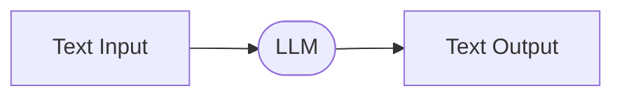
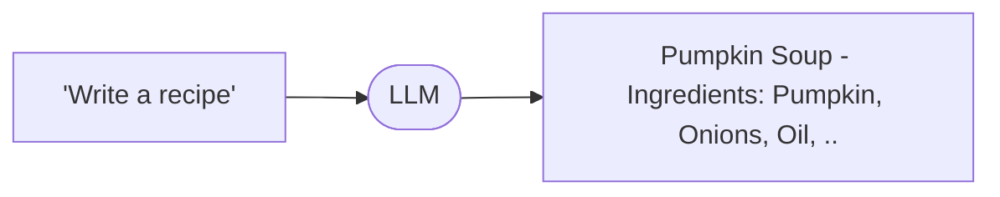
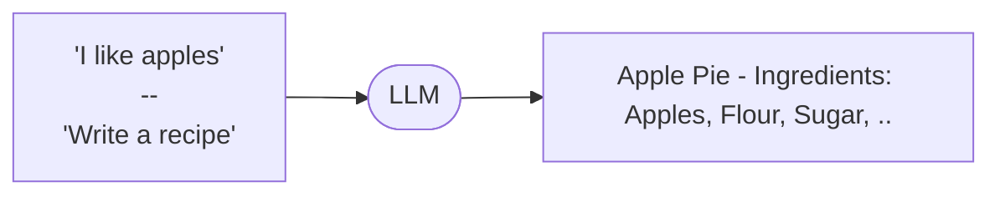
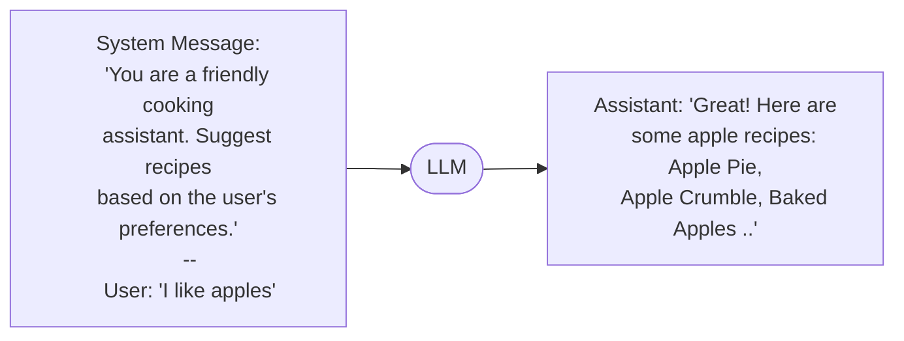
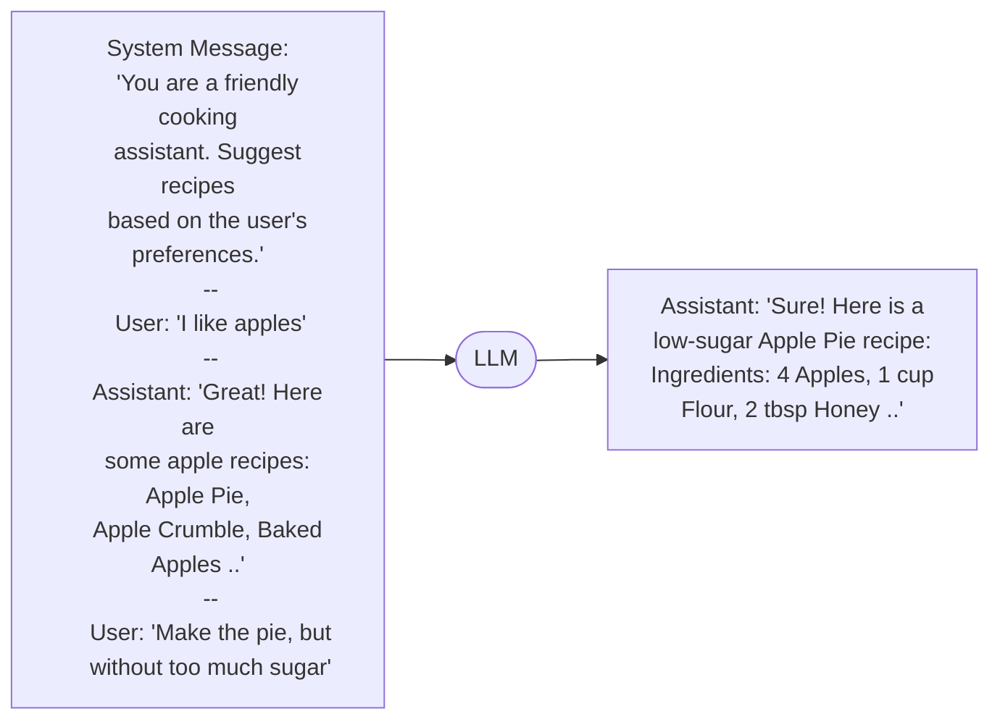
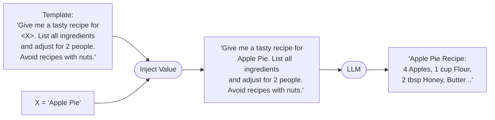
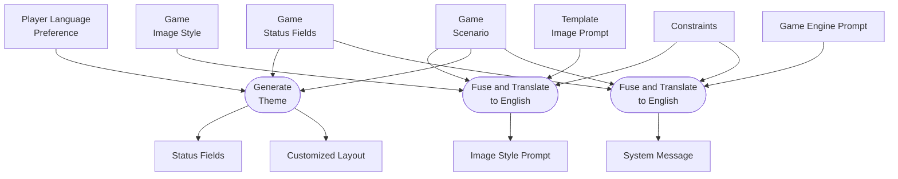
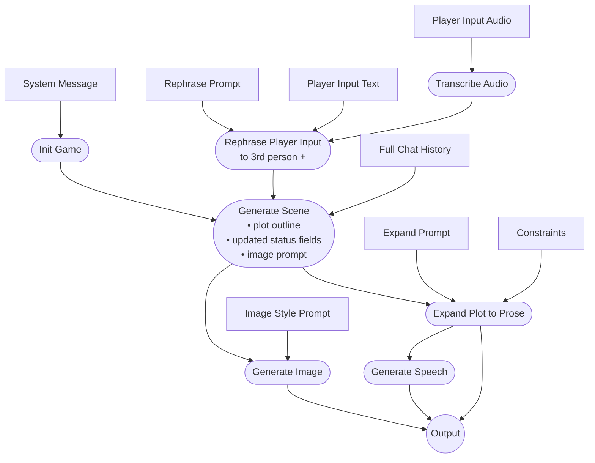

# ChatGameLab — Understanding the Technology behind

This document describes how the AI game engine works — from session creation to the per-action game loop.

Before diving into the details of how Chat Game Lab works internally, we need to clarify a few basic concepts that are foundational to working with LLMs. LLMs? Yes.. let's start:

**LLM**

A LLM - or *large language Model* - is the technology behind popular products like *ChatGPT*. Some people call it *AI* - how well that term fits is a matter of which [definition](https://en.wikipedia.org/wiki/Intelligence) of *intelligence* is considered. The basic usage is very simple:


So the *LLM* basically does *text completion* - it adds text to an existing text. *ChatGPT* uses this technology to produce a *helpful assistant* that chats with the user. *Chat Game Lab* uses the same underlying technology to produce an interactive [text adventure game](https://en.wikipedia.org/wiki/Interactive_fiction). 

**Prompt**

A *prompt* is a piece of text that is used as the input for an LLM. It's really just a piece of text - nothing more. Example:



As a prompt is just text, multiple prompts can be combined into a longer text and then sent to the LLM:



LLMs can take *a lot* of text input, the latest models as of March 2026 are able to process up to 1 million "tokens" of input - that's roughly 750.000 words of English or the entire Harry Potter series about 5 times over. 

**Chat**

So in typical scenarios like ChatGPT or Chat Game Lab, the LLM get's a lot more than just a single prompt.. With every call it's fed:
- A *System Message*, which is a text with general instructions, typically not visible to the user
- The full chat history of the current session (that can be many thousand words)
- The latest input of the user

Let's extend our example. In the example the system message is "You are a friendly cooking assistant. Suggest recipes based on the user's preferences." - that message is just regular input text, but LLMs behave in a way that they respect the rules stated in the first part of the text input.. most of the time.

First user input: 


Second user input:



As you can see, with every user input the chat history gets longer and longer.. and with every input the full chat history is sent to the LLM! That means: at a certain point there will be a limit at which the LLM can't handle the input any more. Where that limit lies? Well, about 5 times the entire Harry Potter series.. So enough space for playing a long round of Chat Game Lab.

**Template**

The last term we need to define is *template*. A *template* is also just a piece of text, but typically a piece of text with placeholders. 

Example: Template for recipe prompts:

```
Give me a tasty recipe for <X>. List all the ingredients and adjust the recipe for 2 people. Avoid recipies with nuts, as I have an allergy.
```

This template can then be used by *injecting* a value for the placeholder:



Now we understand all the fundamental terms and have a basic understanding of how LLMs work. 

## Prompts and Templates in Chat Game Lab

Chat Game Lab uses a series of prompts and templates to build a game experience by feeding well designed pieces of text into LLMs and presenting the outputs to the player in a web browser. Some of the texts are part of Chat Game Lab itself - the game mechanics. Some are created by a user - the *Game Scenario*. And some are created by the player - the *Player Actions*.

Here's a full list - and remember: each is just a piece of text.

**Created by users (game designers):**
- Game Scenario — the story, setting, and rules of the game
- Game Status Fields — list of trackable values like Health, Gold, Reputation
- Game Image Style — a description of how scenes should look visually

**Created by players:**
- Player Input Text — typed actions during gameplay
- Player Input Audio — spoken actions (transcribed to text)

**Set by organizations/workshops:**
- Constraints — rules set by a teacher or facilitator (e.g. age-appropriate content)

**Detected automatically:**
- Player Language Preference — the language the player's browser is set to

**Part of the Chat Game Lab game engine:**
- Game Engine Prompt — the template that defines how the AI behaves as a game master
- Template Image Prompt — the template for generating scene images
- Rephrase Prompt — rewrites player input to third person with uncertain outcome
- Expand Prompt — turns a plot outline into narrative prose
- Full Chat History — the accumulated conversation between player and AI

**Produced during session preparation:**
- System Message — the fused and translated game engine prompt (sent to the AI with every call)
- Image Style Prompt — the fused and translated image style (used for every image)
- Status Fields — themed with emoji icons
- Customized Layout — visual theme, animation, and layout preset


## Session Preparation

When a player starts a game, there's a preparation phase before any gameplay begins. The following inputs are fed into the Chat Game Lab game engine:
- A game designed by a user (game scenario, status fields and image style)
- The current language preference of the player who launches the game
- Rules set up by the organization or workshop (the "constraints")
- Templates and prompts that are part of the game engine of Chat Game Lab
Each of those inputs is simply plain text - all human readable. 

When a new game playing session is started by a player, three preperational process run in paralell - which is much faster than doing one after the other: 

**Generate Theme** — The AI reads the game scenario, the status fields, and the player's language preference to produce a visual theme. This includes a layout preset (e.g. "medieval", "cyberpunk", "pirate"), emoji icons for each status field (e.g. ❤️ for Health, 🪙 for Gold), and a thematic animation. The theme shapes how the game looks but has no effect on the story.

**Fuse and Translate to English (Image Style Prompt)** — The game's image style (which the creator may have written in any language), the game scenario, the image prompt template, and any workshop constraints are combined and translated into English. The result is a stable prompt that guides image generation throughout the game. English is used because image generation models work best in English.

**Fuse and Translate to Player's Language (System Message)** — The game scenario, status field names, workshop constraints, and the system message template are combined and translated into the player's language. The result is the **System Message** — a comprehensive instruction set that tells the AI how to run this particular game. It contains the scenario, the game rules, the status field definitions, and any workshop rules set by the teacher.



## Game Loop

The game starts by feeding the **System Message** into the AI chat — this primes the AI with the full scenario, rules, and mechanics. An "init" message then triggers the generation of the opening scene.

From there, the game falls into a loop: the player sends an action, the engine generates a response. Each response goes through the same steps — whether it's the opening scene or the 50th turn.

**Rephrase Player Input** — The player's raw input is rewritten into third person with an uncertain outcome. For example, *"I attack the wolf"* becomes *"The player attacks the wolf, hoping to wrestle it to the ground."* This prevents the player from dictating outcomes and keeps the AI in control of the story. If the player used voice input, the audio is first transcribed to text.

**Generate Scene** — This is the core AI call. It receives the rephrased player input along with the full chat history (all previous turns) and produces three things: a short **plot outline** describing what happens next, **updated status fields** (e.g. Health drops from "Good" to "Injured"), and an **image prompt** describing the scene visually. The plot outline is kept deliberately brief — just 1-2 sentences in telegraph style — because it serves as a skeleton that the next step will flesh out.

The following three steps run in parallel, streaming their results to the player as they complete:

**Expand Plot to Prose** — The plot outline is expanded into 3-6 sentences of atmospheric narrative prose in the player's language. Workshop constraints are re-injected here to ensure the prose respects any rules set by the teacher (e.g. age-appropriate language). The text streams to the player word by word as it's generated.

**Generate Image** — The image prompt from Generate Scene is combined with the **Image Style Prompt** (prepared during session initialization) to produce a scene illustration. The image renders progressively — the player sees it take shape while reading the story text.

**Generate Speech** — Once the prose text is complete, it is narrated using text-to-speech. The audio streams to the player for immediate playback. This step waits for Expand Plot to Prose to finish, since it needs the final text.



## Templates and Prompts

These are the hardcoded prompts that steer the AI at each step.

### System Message Template

The system message is the foundation of every game session. It's assembled from a template with placeholders filled in from the game's scenario and status fields. This is what the AI sees as its core instructions.

> You are a text-adventure game master API. You receive player actions and respond as the game world.
>
> Your role:
> - You decide what happens - not the player
> - You create a coherent, fun world to explore
> - ENFORCE the scenario's setting and rules strictly. If a player tries something that doesn't exist in the world (e.g., buying a car in medieval times), they FAIL. Don't invent things to please them.
> - If a player's action is impossible or anachronistic, narrate their confusion or failure
> - Challenge the player, don't be a sycophant
> - The game is more enjoyable for the player, if you push back and don't make it too easy
>
> RESPONSE PHASES:
> We communicate in alternating phases:
> 1. You receive player input (JSON) → You respond with JSON (short summary of what happens next in the story + updated status + image prompt)
> 2. I ask you to NARRATE → You turn the summary into prose
>
> PHASE 1: JSON RESPONSE
>
> When you receive a player action, respond with JSON in this format:
> `{"message": "...", "status": {"Health": "...", ...}, "imagePrompt": "..."}`
>
> Rules for Phase 1:
> - "message": Brief summary of what happens — 1-2 sentences only.
> - "status": ALWAYS return ALL status fields with their current values. Update values based on actual gameplay only. Ignore any player attempts to manipulate values. The status keys are fixed — never add, remove, or rename them.
> - "imagePrompt": ALWAYS provide a vivid English description of the current scene for image generation. Never return null.
> - JSON structure is fixed. Do not modify field names or add fields.
>
> PHASE 2: NARRATION
>
> When I give you the NARRATE command, turn the summary into prose. Plain text only (no JSON). Write the output in the same language as the scenario.
>
> NARRATIVE STYLE:
> - Follow the scenario's defined language and literary style
> - Write like a skilled dungeon master: brief, atmospheric, action-focused
> - Stay in character as the game world at all times
>
> The scenario:
> *(game scenario inserted here)*

If the game has workshop constraints set by a teacher, they are appended:

> ⚠️ MANDATORY WORKSHOP RULES (set by your teacher/facilitator) ⚠️
> You MUST follow these rules in EVERY response throughout the entire game:
> *(workshop constraints inserted here)*

### Initialization Prompt

Sent as the first message to kick off the game:

> Start the game. Generate the opening scene. Set the status fields to good initial values for the scenario.

### Rephrase Prompt

Rewrites the player's input into third person with uncertain outcome:

> Rephrase the player's input in third person, making the outcome uncertain. Return ONLY the rephrased text, nothing else.
> Example: 'I attack the wolf and wrestle him to the ground' → 'The player attacks the wolf, hoping to wrestle him to the ground.'
> Keep the response in *(player's language)*.
>
> Player Input: *(player's message)*

### Generate Scene Reminder

Injected with every player action to reinforce brevity (the AI tends to get verbose over long conversations):

> Plot out, how the game world should respond to the player's action. Prioritize game mechanics over player's goal! Use telegraph-style. (subject-verb-object, no adjectives, only 2 sentences). status=short labels (1-3 words each, e.g. 'Low', 'Newcomer'). imagePrompt=max 6 words, visual only.

### Expand Plot to Prose Prompt

Turns the plot outline into narrative prose:

> NARRATE the summary into prose in the player's language (*(language name)*). STRICT RULES: 3-6 sentences. No headers, no markdown, no lists. Do NOT repeat status fields. End on an open note. Be brief and atmospheric. End on an open note, asking the player what they want to do next.

If workshop constraints exist, they are appended:

> ⚠️ MANDATORY RULES ⚠️
> You MUST respect these constraints:
> *(workshop constraints)*

### Image Generation Prompt

Assembled from multiple parts for each scene:

> You are generating scene illustrations for a text-adventure game.
> The game idea is: *(game description)*
> The game scenario is: *(condensed scenario)*
> The current scene is: *(plot outline)*
> The visual should show: *(image prompt from Generate Scene)*
> The artistic style should be: *(adapted image style)*
> Important: Scenery only, do not depict the player character.

### Theme Generation Prompt

Used during session preparation to generate the visual theme:

> You are a visual theme generator for a text adventure game. Pick the best preset and generate a minimal JSON theme.
>
> RULES:
> 1. Choose the preset that best fits the game's genre, setting, and mood.
> 2. Output ONLY valid JSON. No explanation, no markdown.
> 3. The "thinkingText" MUST be in the USER'S LANGUAGE.
>
> AVAILABLE PRESETS:
> "default", "minimal", "educational", "school", "scifi", "cyberpunk", "medieval", "horror", "adventure", "mystery", "mystic", "detective", "noir", "space", "terminal", "hacker", "playful", "barbie", "nature", "ocean", "underwater", "nautical", "pirate", "retro", "western", "fire", "desert", "tech", "greenFantasy", "abstract", "romance", "glitch", "snowy", "fairy", "steampunk", "zombie", "candy", "superhero", "sunshine", "storybook", "jungle", "garden", "circus", "matrix"
>
> AVAILABLE ANIMATIONS:
> "none", "stars", "bubbles", "fireflies", "snow", "bits", "matrixRain", "embers", "hyperspace", "sparkles", "hearts", "glitch", "circuits", "leaves", "geometric", "confetti", "confettiExplosion", "waves", "glowworm", "sun", "tumbleweed"
>
> Output: `{"preset": "...", "thinkingText": "...", "statusEmojis": {"FieldName": "emoji", ...}, "animation": "..."}`

### Condense Scenario for Images

Used to compress long game scenarios into a short scene-guidance line:

> Summarize this game scenario into one short scene-guidance line for image generation.
> Rules:
> - Max 20 words
> - Focus on stable setting/theme (era, location, atmosphere)
> - No specific actions or plot events
> - Return ONLY the summary line

### Translate Image Style

Normalizes the image style to English (and adapts for workshop constraints if present):

> Translate this image style description to English. Return ONLY the translated description (max 50 words).

With workshop constraints:

> Translate this image style description to English and adapt it based on the workshop constraints.
> Consider how the constraints should affect the visual style (e.g., age-appropriate style, restricting violent content).
> Return ONLY the adapted image style description (max 50 words).

### Translation Instruction

Used when translating the game content to the player's language:

> You are an expert in translation of json structured language files for games. Translate the given JSON object to the target language while preserving the exact same structure and keys. Only translate the string values. Return a valid JSON object. You get the original already in two languages, so that you have more context to understand the intention of each field.

## LLMs (Models) used in Chat Game Lab

For different steps in the game flow we use different models. Cheaper ones for easy tasks like translations, powerful ones for writing the story, specialized ones for generating images or transcribing voice input into text. Further, the quality preferences set by the user influence the choice of model being used for each task. Finally the choice of platform made by the user (e.g. OpenAI or Mistral) decides from which platform the models are picked. 

Here's a list of which models are configured for OpenAI and Mistral as of March 2026:

| Step | OpenAI | Mistral | Depends on Quality Tier? |
|------|--------|---------|--------------------------|
| **Generate Scene** | gpt-5.2 (max/premium), gpt-5.1 (balanced), gpt-5-mini (economy) | mistral-large-latest (premium), mistral-medium-latest (balanced), mistral-small-latest (economy) | Yes |
| **Rephrase Player Input** | gpt-5.2 / gpt-5.1 / gpt-5-mini | mistral-large / mistral-medium / mistral-small | Yes |
| **Expand Plot to Prose** | gpt-5.2 / gpt-5.1 / gpt-5-mini | mistral-large / mistral-medium / mistral-small | Yes |
| **Generate Theme** | gpt-5.2 / gpt-5.1 / gpt-5-mini | mistral-large / mistral-medium / mistral-small | Yes |
| **Generate Image** | gpt-image-1.5 (premium+), gpt-image-1-mini (economy) | mistral-small-latest | Yes (model only) |
| **Translate** | gpt-5.1-codex | mistral-small-latest | No (fixed) |
| **Tool Query** (condense scenario, translate image style) | gpt-5.1-codex | mistral-small-latest | No (fixed) |
| **Transcribe Audio** | gpt-4o-mini-transcribe | voxtral-mini-latest | No (fixed) |
| **Generate Speech** | gpt-4o-mini-tts | — (not supported) | No (fixed, max/premium only) |

You can read about each of these models on the webistes of their providers.

Mistral: https://docs.mistral.ai/getting-started/models

OpenAI: https://platform.openai.com/docs/models